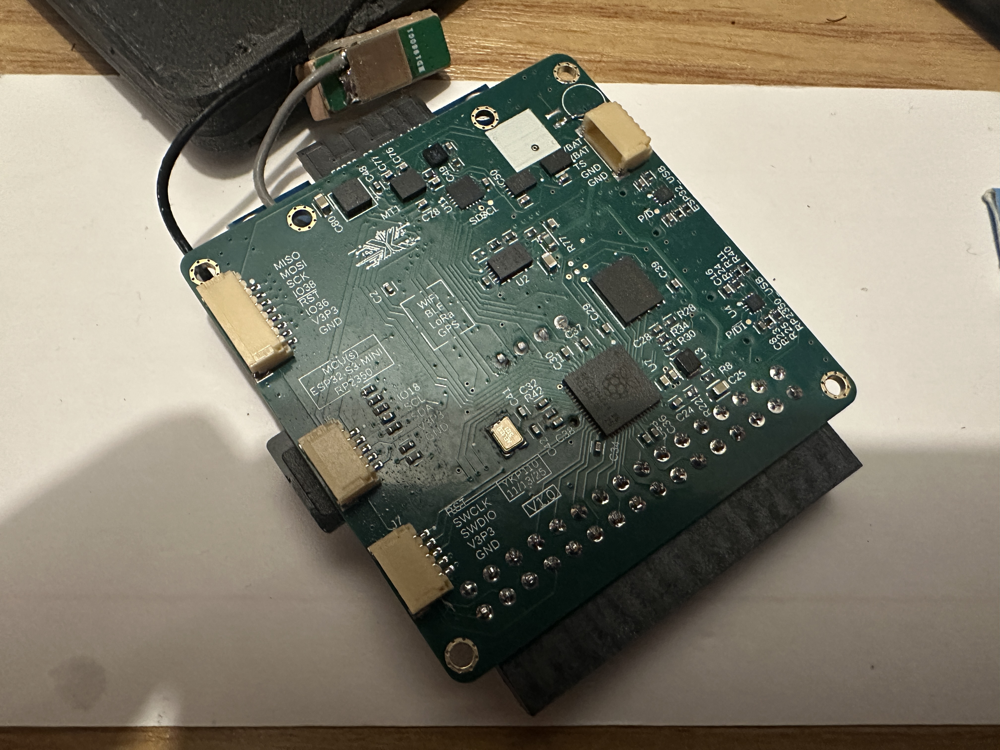
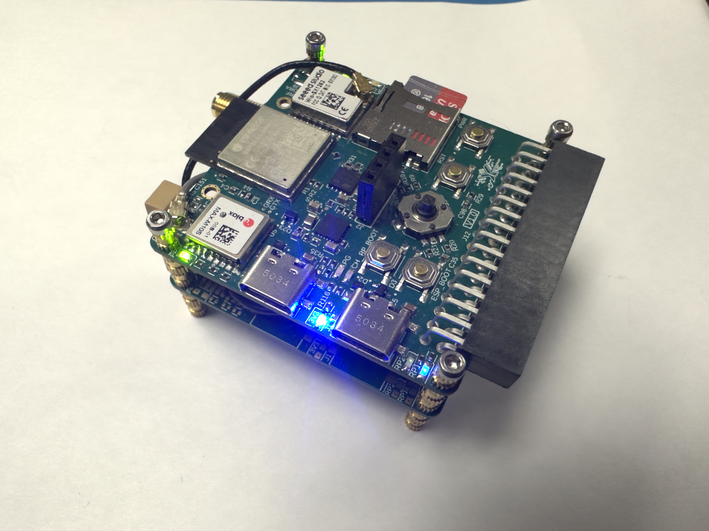
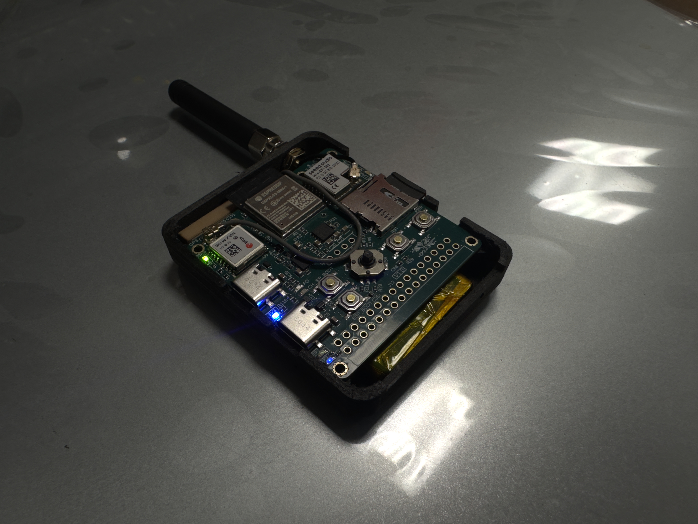
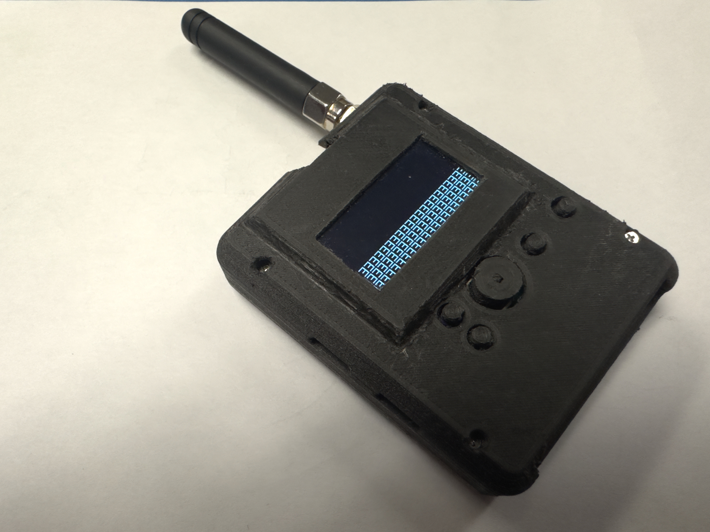

# Project Aether

Project Aether is a compact, secure, multi-sensor wireless node designed for environmental, motion, and location monitoring. It integrates long-range and short-range wireless communication, onboard sensing, secure cryptographic processing, and battery-powered operation in a portable form factor.

---

## Assembled Hardware

Project Aether is designed as a self-contained IoT platform suitable for both field deployment and integration into larger systems.

---

## Hardware Overview

### Core Components
- **ESP32-S3** – Primary MCU handling application logic and wireless connectivity
- **RP2350** – Dedicated I/O expansion and peripheral interface controller
- **LoRa Transceiver** – Long-range, low-power wireless communication (SX-1262)
- **GPS Module** – MAX-M10S for location and timing
- **Cryptographic Coprocessor** – Secure key storage and hardware-assisted cryptography

---

## Sensors & Peripherals

- **9-DOF motion sensing**
    - 3-axis accelerometer
    - 3-axis gyroscope
    - 3-axis magnetometer (compass)
- **Barometric pressure sensor** for altitude and environmental sensing
- **Mini OLED I²C display** for system status and diagnostics
- **Expandable I/O** via RP2350 header

---

## Wireless Connectivity

- **LoRa** – Long-range telemetry
- **Wi‑Fi** – Local connectivity
- **Bluetooth Low Energy (BLE)** – Configuration and diagnostics

External antenna support is provided for RF performance optimization.

---

## Power & Battery Management

- Rechargeable battery support
- Integrated charging, protection, and monitoring (fuel gauge, charger with OTG)
- Designed for low-power operation and portable use

---

## Security

- Dedicated cryptographic coprocessor
- Secure key storage and hardware-assisted cryptography
- Designed to support secure communication and authentication

---

## Design Goals

- Compact, portable form factor
- Secure-by-design architecture
- Modular and extensible firmware
- Suitable for remote and battery-powered deployment

---

## Example Applications

- Remote environmental sensing
- Secure IoT telemetry
- Asset and location tracking
- Motion and orientation monitoring

---

## Repository Structure (top-level)

- coming soon